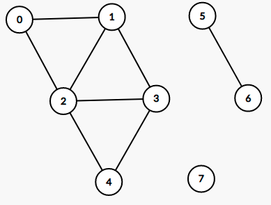

# :computer: Estrutura de Dados 2 
Aprofundamento nos conhecimentos sobre Estrutura de Dados em linguagem C pela Universidade de Brasília - UnB.

## :warning: O que será visto? 
1. Tabela Hash
2. Grafos
3. Árvores

## :arrow_right: Tabela Hash
É uma estrutura de dados especial, que associa chaves de pesquisa à valores, onde seu objetivo é por meio de uma chave simples realizar uma busca rápida para a obtenção de um determinado valor desejado. Nesse contexto, a Hash vem para resolver problemas de complexidade de algoritmos onde se faz necessário a ordenação e busca. Seu funcionamento se baseia na generalização da ideia de array, onde é utilizada uma função para o espalhamento dos dados dentro de uma tabela (Array ou Lista Encadeada) que posteriormente permite o acesso direto a esses determinados dados, praticamente sem nenhuma etapa de comparação ou loop, tendo uma complexidade para maioria dos casos de O(1).
* Vantagens:
Alta eficiência em busca;
Tempo de busca é praticamente idependente do número de chaves armazenadas na tabela e sua implementação é simples;
* Desvantagens:
Alto custo para recuperar os elementos da tabela não ordenados pela chave (Nesse caso é necessário a ordenação);
Pior caso O(n), sendo N o tamanho da tabela, resultado de um alto número de colisões (quando dois elementos tentam ocupar a mesma posição dentro da tabela).
* Tipos de tratamento para Colisões:
    1. Endereçamento Aberto 
    2. Endereçamento Fechado 
* Aplicações
    1. Busca de elementos em uma base de dados
    2. Criptografia MD5 e Família SHA 
    3. Implementação da tabela de símbolo dos compiladores
    4. Armazenamento de senhas com segurança: a senha não é armazenada no servidor, mas sim no resultado da função hash.
    5. Verificação da integridade de dados de autenticação de mensagens. 
    6. Entre outros. 

## :arrow_right: Grafos
É um módulo matemático que representa relações entre objetos, sendo utilizado na definição e/ou resolução de problemas de diversas áreas. Um Grafo é composto por um conjunto de Vértices e um conjunto de Arestas, ou também chamados de Nós e Rotas.

Logo, o que é um Vertice? É cada uma das entidades respresentadas em um grafo, pode variar dependendo da sua natureza, sendo pessoas, lugares, casas, ... etc. Duas vértices são adjacentes se existir uma aresta ligando elas. 

Logo, o que é uma aresta? Também chamada de Rotas ou Arco, é uma estrutura associada a dois vértices (v1, v2), responsável por fazer a ligação entre eles.

* Aplicações:
Busca pela melhor rota entre dois pontos.
Verificação de ligações entre usuários/pontos/lugares ... entre outros. 
