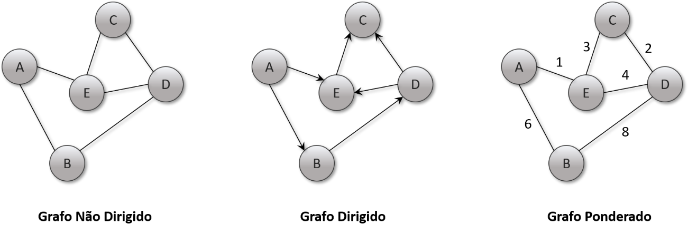
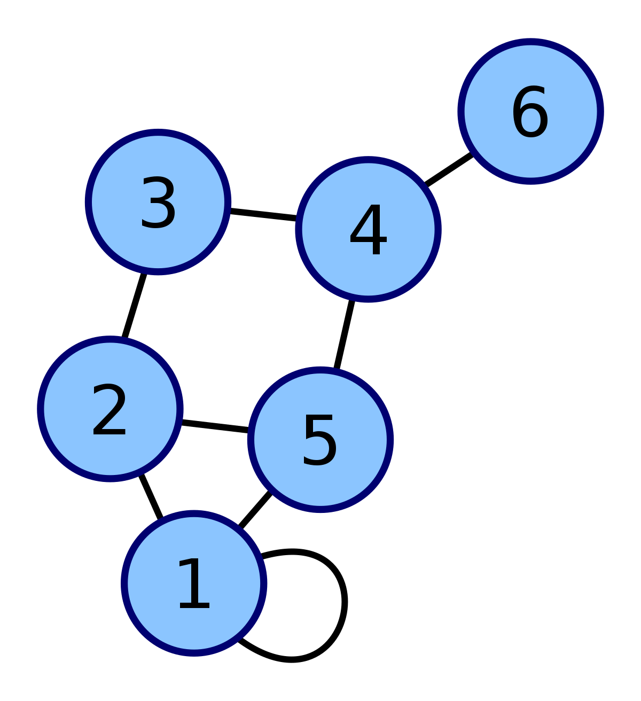
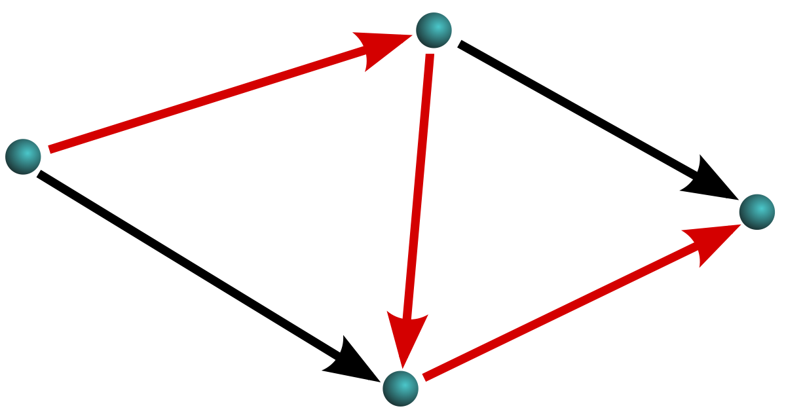
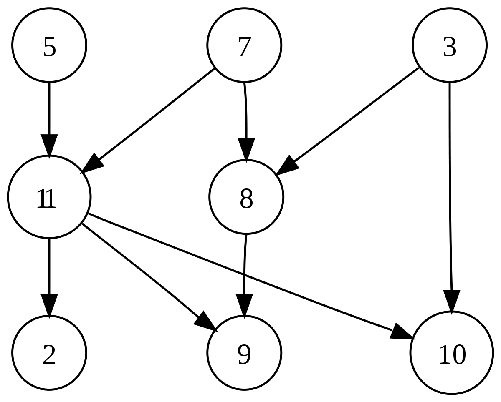

# :computer: Estrutura de Dados 2 
Aprofundamento nos conhecimentos sobre Estrutura de Dados em linguagem C pela Universidade de Brasília - UnB.

## :warning: O que será visto? 
1. Tabela Hash
2. Grafos
3. Árvores

## :arrow_right: Tabela Hash
É uma estrutura de dados especial, que associa chaves de pesquisa à valores, onde seu objetivo é por meio de uma chave simples realizar uma busca rápida para a obtenção de um determinado valor desejado. Nesse contexto, a Hash vem para resolver problemas de complexidade de algoritmos onde se faz necessário a ordenação e busca. Seu funcionamento se baseia na generalização da ideia de array, onde é utilizada uma função para o espalhamento dos dados dentro de uma tabela (Array ou Lista Encadeada) que posteriormente permite o acesso direto a esses determinados dados, praticamente sem nenhuma etapa de comparação ou loop, tendo uma complexidade para maioria dos casos de O(1).
* Vantagens:
Alta eficiência em busca;
Tempo de busca é praticamente idependente do número de chaves armazenadas na tabela e sua implementação é simples;
* Desvantagens:
Alto custo para recuperar os elementos da tabela não ordenados pela chave (Nesse caso é necessário a ordenação);
Pior caso O(n), sendo N o tamanho da tabela, resultado de um alto número de colisões (quando dois elementos tentam ocupar a mesma posição dentro da tabela).
* Tipos de tratamento para Colisões:
    1. Endereçamento Aberto 
    2. Endereçamento Fechado 
* Aplicações
    1. Busca de elementos em uma base de dados
    2. Criptografia MD5 e Família SHA 
    3. Implementação da tabela de símbolo dos compiladores
    4. Armazenamento de senhas com segurança: a senha não é armazenada no servidor, mas sim no resultado da função hash.
    5. Verificação da integridade de dados de autenticação de mensagens. 
    6. Entre outros. 

## :arrow_right: Grafos
É um módulo matemático que representa relações entre objetos, sendo utilizado na definição e/ou resolução de problemas de diversas áreas. Um Grafo é composto por um conjunto de Vértices e um conjunto de Arestas, ou também chamados de Nós e Rotas.

Logo, o que é um Vertice? É cada uma das entidades respresentadas em um grafo, pode variar dependendo da sua natureza, sendo pessoas, lugares, casas, ... etc. Duas vértices são adjacentes se existir uma aresta ligando elas. 

Logo, o que é uma aresta? Também chamada de Rotas ou Arco, é uma estrutura associada a dois vértices (v1, v2), responsável por fazer a ligação entre eles.

### :warning: Propiedades 
#### Sobre a direção das Arestas
* Grafo Direcionado/Dirigido: Existe uma orientação quanto ao sentido da aresta. Se uma aresta liga 'A' E 'B', podemos ir de 'A' para 'B', mas não de 'B' para 'A'. 
* Grafo não Direcionado/Dirigido: Não existe orientação quanto ao sentido da aresta. Podemos ir de tanto de 'A' para 'B', como de 'B' para 'A'. 

#### Sobre o Grau de um Vértice
É o número de arestas que chegam ou partem dele. No caso de grafos direcionados temos: Grau de Entrada para as arestas que chegam até ele, e Grau de Saída para as arestas que partem dele. 

#### Laço
Uma aresta é chamada de "Laço" se seu vértice de partida é o mesmo vértice de chegada, ou seja, a aresta conecta o vértice com ele mesmo (v1,v1).

#### Caminho
É uma sequência de vértices de modo que existe sempre uma aresta ligando o vértice anterior ao seguinte. Caminho simples: Nenhum vértice no caminho se repete. Comprimento: É o número de arestas que o caminho usa. 

#### Ciclo
É um caminho que começa e termina no mesmo vértice. Um laço é um ciclo de comprimento 1.

#### Grafo Acíclico 
Não contém "ciclos" simples (onde cada vértice aparece apenas uma vez cada).

#### Arestas Multiplas
É um Grafo que permite mais de uma aresta conectando um par de vértices.

### :warning: Tipos
* Grafo Trivial: Grafo simples com um único vértice e sem arestas.
* Grafo Simples: É um Grafo não direcionado, sem laços e sem arestas paralelas. 
* Grafo Completo: É um Grafo simples onde cada vértice se conecta a todos os outros vértices.
* Grafo Regulas: É um Grafo onde todos os vértices possuem o mesmo grua. 
* SubGrafo: Um SubGrafo G1(v1,a2) é chamado de subgrafo de G(v, a) se "v1" está contido em "v" e "a2" está contigo em "a".
* Grafo Bipartido: É um grafo cujos vértices podem ser divididos em dois conjuntos. Nesse caso, as arestas ligam os vértices que estão em conjuntos diferentes, nunca ligando vértices do mesmo conjunto. 
* Grafo Conexo: Existe um caminho partindo qualquer vértice até qualquer outro vértice do Grafo. 
* Grafo não Conexo: Não existe um caminho ligando dois vértices selecionados. 
* Grafo Isomorfo: Dois Grafos, "A(v1,a1)" e "A2(v2, a2)"', são isomorfos se existir uma função que faça o mapeamento de vértices e arestas de modo que os dois grafos se tornem coincidentes. 
* Grafos Ponderados: É um Grafo que possui "pesos" associados a cada uma de suas arestas. 
* Grafo Hamiltoniano: É um Grafo que possui um caminho que visita cada "vértice" apenas uma vez.
* Grafo Euleriano: É um Grafo que possui um "ciclo" que visita cada aresta apenas uma vez. 
* Grafo Semi-Euleriano: É um Grafo que possuium caminho que visita "caminho" que visita cada aresta apenas uma vez.

* Aplicações:
Busca pela melhor rota entre dois pontos.
Verificação de ligações entre usuários/pontos/lugares ... entre outros. 
